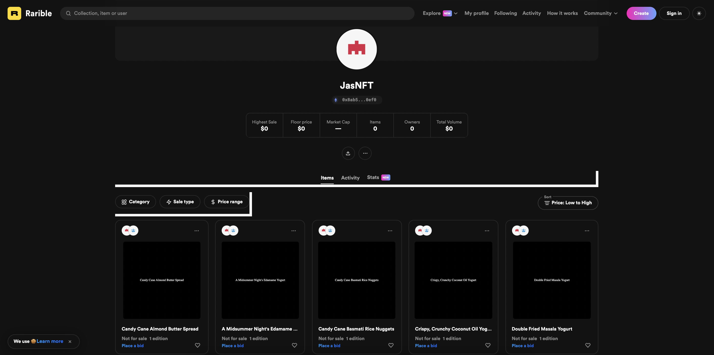

# Mint Randomly Generated Trader Joe's Product NFT

buildspace's mint your own NFT collection and ship a Web3 app to show them off project 




### Live dApp Deployed on Replit: [Mint TJ NFT](https://nft-starter-project.jasminesabio.repl.co/)

Requirements: Metamask browser extension installed and connected to the Rinkeby Test Network

## Installing dApp Locally
### Development Environment Set Up to Run Project Locally (macOS or Linux System)
1. Download a Code Editor (Visual Studio Code, Sublime, etc)
2. Install Homebrew
```
/bin/bash -c "$(curl -fsSL https://raw.githubusercontent.com/Homebrew/install/HEAD/install.sh)"
```
3. Install [Node](https://nodejs.org/en/)
4. Install Git
```
brew install git
```
5. Install Hardhat
```
npm install --save-dev hardhat
```

### Running the Project Locally
In the terminal, clone the project repository
```
git clone https://github.com/jasminesabio/mint-nft
```

In the terminal in the root directory of the project, install the dependecies
```
npm install
```

To run the frontend locally, run
```
npx hardhat run scripts/run.js
```